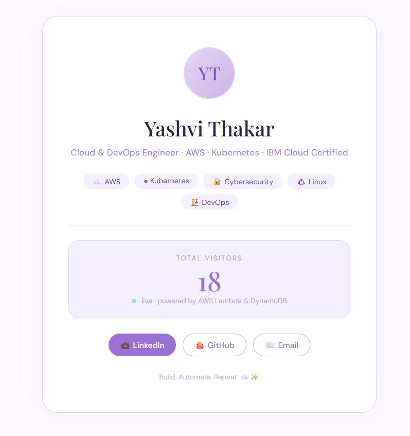

<div align="center">

# ☁️ AWS Cloud Resume
### Serverless Resume with Live Visitor Counter
### *A full-stack cloud project — not just a static page.* ✨

[]()
[]()
[]()
[]()
[]()
[]()

</div>

---

## ☁️ What is this?

> *Not just a resume — a fully serverless, cloud-powered web application.*

This is my **AWS Cloud Resume Challenge** — a full-stack serverless project where my resume page tracks and displays real-time visitor counts using AWS Lambda, DynamoDB, and API Gateway. Infrastructure is provisioned using **Terraform** (Infrastructure as Code).

Every visit to the page:
1. Calls an **API Gateway** endpoint
2. Triggers an **AWS Lambda** function
3. Updates a **DynamoDB** counter
4. Returns the live count to the page instantly ✅

---

## 🖥️ Live Preview

<div align="center">

</div>

> 🟢 **Live** — visitor counter powered by AWS Lambda & DynamoDB in real time

---

## 🏗️ Architecture

```
User visits the page
        ↓
Amazon S3 (Static website hosting)
Serves index.html — HTML · CSS · JavaScript
        ↓
JavaScript fetch() calls API Gateway endpoint
        ↓
Amazon API Gateway (REST API)
        ↓
AWS Lambda (Python — lambda_function.py)
Reads & updates visitor count
        ↓
Amazon DynamoDB
Stores and returns total visitor count
        ↓
Counter displayed live on page ✅
```

---

## ☁️ Tech Stack

| Layer | Technology |
|---|---|
| 🌐 **Frontend** | HTML · CSS · JavaScript |
| 🪣 **Hosting** | Amazon S3 Static Website |
| 🔗 **API** | Amazon API Gateway (REST) |
| ⚡ **Compute** | AWS Lambda (Python) |
| 🗄️ **Database** | Amazon DynamoDB |
| 🏗️ **IaC** | Terraform (`main.tf`) |
| 🔐 **Security** | AWS IAM Roles & Policies |

---

## ✨ Key Features

- 🚀 **Live visitor counter** — real-time count on every page load
- ⚡ **Fully serverless** — no EC2, no server management
- 🏗️ **Infrastructure as Code** — provisioned with Terraform
- 🔐 **CORS configured** — secure API Gateway integration
- 💰 **AWS Free Tier friendly** — runs at near zero cost
- 🎨 **Aesthetic UI** — lavender themed, responsive design

---

## 📂 Project Structure

```
aws-cloud-resume/
│
├── index.html              # Frontend — resume page with visitor counter
├── lambda_function.py.txt  # AWS Lambda function (Python — Boto3)
├── main.tf                 # Terraform IaC — AWS infrastructure config
├── preview.png             # Live site screenshot
└── README.md
```

---

## 🚀 How It Works

```
Step 1 → User opens the resume page hosted on S3
Step 2 → JavaScript calls API Gateway endpoint on load
Step 3 → API Gateway triggers Lambda function
Step 4 → Lambda reads current count from DynamoDB
Step 5 → Lambda increments count + saves to DynamoDB
Step 6 → Count returned as JSON to frontend
Step 7 → Page displays live visitor number ✅
```

---

## 🏗️ Infrastructure as Code — Terraform

This project uses **Terraform** to provision AWS infrastructure — meaning the entire backend (Lambda, API Gateway, DynamoDB, IAM) can be recreated with a single command:

```bash
terraform init
terraform plan
terraform apply
```

> This is a key DevOps skill — infrastructure should be versioned, repeatable and automated. 💜

---

## 💡 What I Learned

- Building a **full-stack serverless application** on AWS
- Connecting **S3 → API Gateway → Lambda → DynamoDB** end to end
- Writing **Python Boto3** scripts to read/write DynamoDB
- Handling **CORS** for secure cross-origin API calls
- Provisioning **AWS infrastructure with Terraform** (IaC)
- Hosting a **static website on S3** with public access policies

---

## 🔗 Related Projects

| Project | Stack |
|---|---|
| [Vision Vault — Serverless App](https://github.com/yashvi-create/vision-vault-serverless-app) | Lambda · API Gateway · DynamoDB |
| [Phoenix Gateway — HA Architecture](https://github.com/yashvi-create/phoenix-gateway-aws) | CloudFront · S3 · Origin Failover |
| [Operation Fire — Blue Team Lab](https://github.com/yashvi-create/operation-fire-blue-team-lab) | Kali Linux · Sysmon · SIEM |

---

## 👩‍💻 Built By

<div align="center">

**Yashvi Thakar** — Cloud & DevOps Engineer

[](https://www.linkedin.com/in/yashvithakar/)
[](https://github.com/yashvi-create)

*Build. Automate. Repeat.* ☁️✨

</div>
